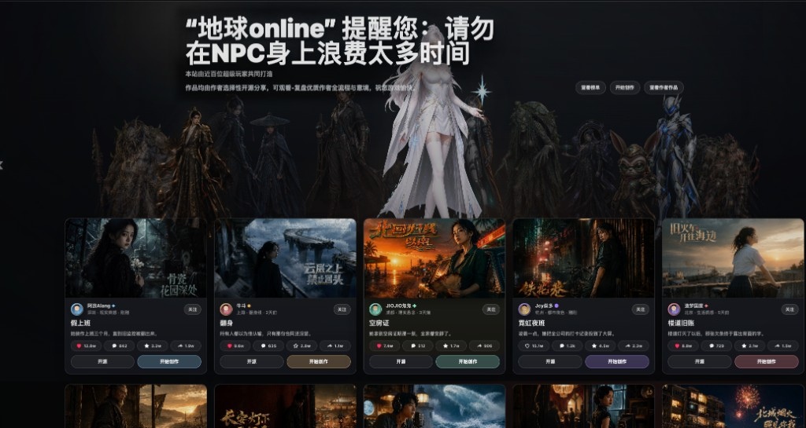

# PRD: 小提大作（融合升级版）
*Working title — 沿用「小提大作」品牌（决策①），待最终确认。*

## 0. 文档说明

本 PRD 面向产品、研发、设计与下游工作流负责人（UX / 架构 / 史诗故事拆分）。它把「小提大作 + 大作联盟」融合后的**目标全景**产品化，作为后续 UX 规范、技术架构与开发排期的统一契约。

- **主输入**：`_bmad-output/planning-artifacts/小提大作-融合升级版-功能架构.md`（融合功能架构，已含 8 项拍板决策）；`小提大作-功能架构-线上版.md`（线上事实基线）；`大作联盟-功能架构草稿.md`（能力供体）。
- **结构约定**：术语在 §3 统一定义，功能按模块分组、功能需求（FR）全局编号且稳定；推断处以 `[ASSUMPTION]` 内联标注并汇总于 §12 索引。
- **范围说明（决策⑧）**：本 PRD 覆盖**目标全景**；**MVP 切分与开发排期在下一阶段进行**（§7 给出候选切分供讨论，不作为本期承诺）。
- **技术选型**属实现细节，仅在必要处作为约束提及，详细取舍归档到 `addendum.md`。

---

## 1. 愿景

**小提大作（融合升级版）** 是一个面向网文、剧本、短剧漫剧与微电影创作者的 **「AI 创作 + 内容/工作流/知识库交易 + 版权合作 + 收益分成分佣」一体化中台**。用户在同一账户内完成从「写小说 / 做漫剧视频」到「确权 / 挂牌售卖 / 获授权制作 / 拿分成与佣金 / 提现开票」的全链路，创作与变现不再割裂在两个系统里。

产品以**小提大作**的双创作入口（写作、画布）、版权中心与数据结算为骨架和样式基座，吸收**大作联盟**的 SOP 严格流水线、生产指挥舱、提示词/工具库、大赏社区等能力，并在其上补齐「制作 → 售卖 → 分成 → 分佣 → 提现/发票」的商业闭环。对创作者，它把零散工具收敛为一条可复盘、可复用、可变现的生产线；对团队/工作室，它是可调度、可质检的生产 OS；对版权方，它是可入驻、可授权、可结算的合作平台。

差异化主张延续大作联盟大赏的核心洞察：**「可复盘、可学习、可复用的创作过程」比单纯炫成片更有价值** —— 成片、工作流与知识库彼此引流，构成增长与变现飞轮。

---

## 2. 目标用户

### 2.1 Jobs To Be Done

- **个人网文/剧本创作者**：把脑内故事高效产出为可读小说或可拍剧本，并能挂牌授权换取收益。
- **漫剧/短剧视频创作者**：用 AI 流水线把文本变成成片，降低制作门槛，并靠售卖/播放分成变现。
- **新手创作者**：需要「傻瓜式」引导（SOP 分阶段确认），不必理解节点图也能产出一部作品。
- **熟练创作者/工作室**：需要自由节点画布 + 可复用工作流 + 团队调度质检，追求产能与稳定质量。
- **版权方/IP 合作方**：把自有 IP/作品登记确权、上架授权，靠授权分成变现，且要能线上结算与开票。
- **变现型用户（分销/达人）**：靠邀请分佣获得收益，需要清晰的佣金、提现与发票能力。
- **平台运营方（我方）**：需要统一的确权、交易、结算、风控与数据看板来运营整条商业链路。

### 2.2 非目标用户（v1）

- 纯知识付费/在线课程的教学者 —— 知识库不含教程/方法论类内容（决策⑤）。
- 无创作意图、仅消费成片的纯观众 —— 影片大赏面向引流，不是独立的长视频消费平台。
- 需要私有化部署/本地离线的企业 —— v1 为云端 SaaS 中台。`[ASSUMPTION: v1 仅云端 SaaS，不做私有化部署]`

### 2.3 关键用户旅程

- **UJ-1. 阿哲用引导模式做出人生第一部漫剧。**
  阿哲是想做短剧的新手，登录后从「大作创建」选一个爆款题材起项目，进入画布的 **SOP 引导模式**，逐阶段确认选题 → 风格 → 剧本 → 分镜 → 人物 → 场景，系统按严格流水线 gate 推进、逐段消耗爆米花，中途某段生成失败后点「重试」断点续跑。全流程走完导出成片，一键挂到影片大赏。**价值落点**：他第一次不看教程就完整产出一部作品。

- **UJ-2. 林姐把畅销小说确权后授权给漫剧作者，坐收分成。**
  林姐是网文作者，在写作模块完成小说后，一键到版权中心**登记确权**并挂牌授权。漫剧作者小鹿在版权中心提交**授权申请**，审核通过后基于该 IP 制作漫剧。成片售卖与播放产生收益，按分成规则**线上结算**回流给林姐，她在数据看板发起**提现**并申请**发票**。**价值落点**：创作与授权收益在同一平台闭环，替代过去的线下分佣。

- **UJ-3. 王工作室用指挥舱把 8 个项目管到成片。**
  王工作室是团队 Pro 用户，成员各自在画布/写作生产，产出**自动进入生产指挥舱的 G0–G9 看板**（决策②）。制片人看到 G3 分镜「风险」、G6 视频「风险」，据日报的废图率/返工原因调度人力，QC 在 G8 审核卡口拦截不合格交付。**价值落点**：个人生产与团队调度是同一份数据的双视角，管人管进度管质检一屏可见。

- **UJ-4. 小鹿把打磨好的工作流上架市场，被同行订阅复用。**
  小鹿在画布里沉淀出一套高质量「小说转漫剧」工作流，登记产权后上架**工作流市场**，设为订阅制。其他创作者付费订阅复用，小鹿获得持续分成，并通过**邀请分佣**带来的下级消费再获佣金，统一在结算中台提现开票。**价值落点**：把「怎么做」本身变成可持续售卖的资产。

*（消费级/UX 细节旅程可在 UX 阶段展开；本 PRD 以上述 4 条锚定主链路。）*

---

## 3. 术语表（Glossary）

下游工作流与本文其余部分必须逐字使用这些术语，不得引入同义词。

- **写作（Writing）** — 面向小说/文本创作的工作流；交付物是**小说文本**。与画布是两条独立工作流。
- **画布（Canvas）** — 面向漫剧/短剧视频制作的工作流；由**自由节点图**与**SOP 引导模式**两种模式组成；交付物是**视频成片**。
- **节点（Node）** — 画布中的最小操作单元（文本/图片/视频/音频/Agent/生成节点）。
- **工作流（Workflow）** — 画布中可创建、复用、复制、售卖的节点编排；是可交易资产之一。
- **SOP 引导模式** — 画布内基于大作联盟严格流水线的分阶段引导：选题→风格→剧本→分镜→人物→场景→合成→图→视频→成片。
- **作品（Work）** — 创作产出的可交易内容实体：小说 / 剧本 / 漫剧成片。
- **项目（Project）** — 一次创作的组织容器，聚合作品、素材、生产状态；对应工作台「项目」，融合原「我的空间」。
- **资产（Asset）** — 角色、场景、模型等可复用创作素材；含审核状态。
- **提示词（Prompt）** — 可分类、可复用、可售卖的提示词/模板，记录使用次数与成功率。
- **知识库（Knowledge Pack）** — 可售集合：风格包 / 提示词包 / 素材·角色·场景库（**不含**教程/方法论类知识付费，决策⑤）。
- **版权中心（Copyright Center）** — 登记、确权、授权申请、合作方入驻、封面工坊的统一模块。
- **确权 / 产权（IP Verification / Ownership）** — 对作品、工作流、知识库登记权属，绑定作者账户，是售卖/授权/分成的权属依据。
- **授权（Authorization）** — 使用方向版权方申请并获批后取得的制作/使用许可。
- **指挥舱（Command Center）** — 团队生产调度模块（Pro/团队版付费增值，决策③），以 G0–G9 门（Gate）管理生产。
- **Gate（G0–G9）** — 生产阶段门：立项/大纲/剧本/分镜/资产/分镜图/视频/成片/审核/复盘。
- **市场（Market）** — 作品 / 工作流 / 知识库的交易市场。
- **米花 / 爆米花（Mihua / Baomihua）** — 平台计费虚拟货币；写作/画布每次 AI 生成按 `getCost` 计费消耗。
- **分成（Revenue Share）** — 版权分成 + 视频播放分成，收益按比例反哺创作者/版权方。
- **播放分成（Playback Share）** — 基于成片播放表现的分成；数据来源为用户自报 + 第三方回传（协议待定，决策⑥）。
- **分佣（Commission）** — 邀请分佣产生的佣金；分佣层级与链路沿用现有产品能力（决策④）。
- **结算中台（Settlement）** — 汇集所有收入来源，走「数据看板 → 结算明细 → 提现 / 发票」。
- **提现（Withdraw）** — 结算余额发起的资金提取（本期新建，决策④）。
- **发票（Invoice）** — 对可开票金额的开票申请与记录（本期新建，决策④）。
- **影片大赏（Film Showcase）** — 工作台左侧导航首项（原「首页」）；使用聪哥制作的大赏页面内容，展示 **IP 与影片**。作品展示广场 + 创作社区，成片可反向复盘创作过程，作为引流入口。与「光影展厅 /showcase」为同一页面能力，统一以「影片大赏」对外命名。
- **体验（Experience）** — 游客免登录试用/样例体验入口（决策⑦纳入）。
- **影片 musicmv** — 音乐 MV / 影片制作，画布视频能力的题材化封装（决策⑦纳入）。

---

## 4. 功能需求（Features）

> 功能按模块分组；FR 全局编号（FR-1…FR-N）保持稳定；`[ASSUMPTION]` 内联标注推断项。

### 组 A · 创作生产

#### 4.1 写作（小说/文本创作）
**描述：** 面向小说/网文的结构化创作工作流：作品设置（类型/风格/自定义要求）→ 整体架构（大纲）→ 细纲（章节细纲/排序/增合并）→ 章节正文（AI 生成/替换/重生成）→ 导出全文。可挂接写作角色库与提示词库，写完可一键进入版权中心确权/挂牌。实现 UJ-2。使用米花计费。

**功能需求：**

##### FR-1：结构化写作流水线
[创作者] 可按「作品→大纲→细纲→章节正文」逐层生成并编辑小说文本。
- 可设定作品类型、写作风格、写作/大纲/细纲指令与自定义要求。
- 支持章节新增/合并/排序、正文替换与重新生成。
- 可导出全文（至少支持 TXT/DOCX 之一）。`[ASSUMPTION: 导出格式含 TXT+DOCX]`

##### FR-2：写作角色库与素材关联
[创作者] 可在写作中维护角色设定并关联素材，保持人物一致性。
- 角色/素材变更可被后续章节引用。

##### FR-3：写作产出接入确权/交易
[创作者] 可将完成的小说一键提交至版权中心登记确权并挂牌。实现 UJ-2。
- 提交后在版权中心生成可授权/可售卖条目（见 FR-20）。

#### 4.2 画布（漫剧视频制作 · 自由节点图 + SOP 引导模式）★核心
**描述：** 画布是漫剧视频的生产核心，提供**双模式**：①**自由画布**（节点图 + 工作流，面向熟练用户）；②**SOP 引导模式**（面向新手/标准化生产，基于大作联盟严格流水线分阶段确认）。两模式共享同一份画布数据，可随时切换。每次生成按爆米花 `getCost` 计费。实现 UJ-1、UJ-3、UJ-4。

**功能需求：**

##### FR-4：自由画布节点编排
[创作者] 可在无限画布上添加/整理/删除/复制节点、平移、连线、面包屑导航，编排文本/图片/视频/音频/Agent/生成节点。
- 支持工作流创建、复用、复制。
- 节点分类覆盖：Agent 复合节点（小说转剧本、剧本转分镜、场景调度台等）、原子生成节点（生图/生视频/图生视频/文生视频/首尾帧/姿势/字幕擦除/精准动作控制器）、基础节点、自动运行节点。

##### FR-5：SOP 引导模式（严格流水线）
[创作者] 可选择引导模式，按 选题→风格→剧本→分镜→人物→场景→合成→图→视频→成片 逐阶段生产。
- 严格流水线 gate：前序阶段未完成则锁定后序（`completed` 逐项标记）。实现 UJ-1。
- 支持创作模式选择：film 微电影 / serial-ip 连载IP（infinite 无限连载 / microfilm）。
- 每阶段产物即画布节点，可切到自由画布继续精修。

##### FR-6：流水线状态机与断点续跑
[系统] 维护生产状态（idle/running、current_step、failed_step、error_message、videoGenerated、canvasReady），支持失败重试与断点续跑。实现 UJ-1。
- 某阶段失败时提供「重试」并从失败步恢复，不丢失已完成产物。
- Agent 产物落标准目录：`01_剧本/02_分镜/03_人物/04_场景/05_质检/06_风格`。

##### FR-7：风格/人物/场景增强库
[创作者] 可调用 555 风格 / 72 分类 / IP 大师库，设定人物记忆一致性与场景锁定规则。
- 资产锁定规则：关键资产项缺失时阻断进入视频阶段（「缺一项不得进视频」）。

##### FR-8：视频合成与批量下载
[创作者] 可对分镜生成图片、由图/文生成视频、叠加音频与字幕擦除，导出成片并批量下载全部分镜/成片。

##### FR-9：画布生成计费
[系统] 每次生成通过 `getCost` 预估并扣减爆米花，可选生成数量/生成模式/使用模型。
- 余额不足时阻断生成并引导充值。

#### 4.3 影片 musicmv（决策⑦）
**描述：** 音乐 MV / 影片制作，是画布视频能力的题材化封装，提供更贴合 MV/影片的模板与产出。`[ASSUMPTION: musicmv 复用画布引擎，仅在题材模板/交付形态上差异化，不新建独立生产引擎]`

**功能需求：**

##### FR-10：影片/MV 题材化制作
[创作者] 可从 musicmv 入口选择影片/MV 模板，复用画布能力产出并导出。

#### 4.4 大作创建（题材化起项目）
**描述：** 内置海量短剧爆款题材库，一键起项目并衔接画布 SOP 引导模式，与大作联盟「选题/爆款众筹」合并为统一题材入口。实现 UJ-1。

##### FR-11：题材库一键起项目
[创作者] 可从题材库选题创建项目，直接进入画布引导模式。
- 内置多赛道爆款题材标签（逆袭/战神/末世/赛博等）。

#### 4.5 资产库（角色/场景/模型 + 审核）
**描述：** 统一资产中枢，含角色库、写作角色库、场景库、模型库与「我的审核」。为画布与写作共享。`[ASSUMPTION: 写作角色库与画布角色库同源，统一在资产库管理]`

##### FR-12：统一资产管理
[创作者] 可创建/管理角色、场景、模型资产，设定锁定规则与参考图。

##### FR-13：资产审核
[创作者/审核员] 可在「我的审核」处理资产/授权相关审核事项。

#### 4.6 提示词库
**描述：** 来自大作联盟的提示词/模板库（含封面提示词、IP 提示词模板），按阶段/类型分类，记录使用次数、成功率、负责人、锁定状态；供画布各阶段与版权封面工坊调用。

##### FR-14：提示词库管理与调用
[创作者] 可分类维护提示词/模板，在画布阶段与封面工坊一键调用。
- 记录并展示使用次数与成功率。

#### 4.7 工具与外接接口
**描述：** 来自大作联盟 ideas 的工具箱（可直达画布）+ 在设置中配置的外接接口（API 对接）。

##### FR-15：工具箱直达画布
[创作者] 可从工具箱使用扩展工具并直达画布。

##### FR-16：外接接口配置
[创作者] 可在设置中配置外接 API 对接。`[ASSUMPTION: 外接接口为用户自有第三方能力接入，非平台开放 API 平台]`

---

### 组 B · 版权与交易

#### 4.8 版权/文创中心
**描述：** 以小提大作版权中心为骨架，融合大作联盟 IP 确权、封面成对、IP 大师/画廊，并新增合作方入驻与统一产权登记。覆盖登记→挂牌/申请→审核→授权→制作/使用→分成结算的线上闭环，替代原线下分佣。实现 UJ-2、UJ-4。

**功能需求：**

##### FR-17：统一确权/产权登记
[创作者/版权方] 可对作品、工作流、知识库登记产权，绑定账户。
- 登记项作为售卖/授权/分成的权属依据。

##### FR-18：授权申请与审核状态机
[使用方] 可提交授权申请；[版权方/平台] 审核。状态机：登记→挂牌/申请→审核→授权→制作/使用→分成结算。实现 UJ-2。
- 未获授权不得基于该 IP 制作漫剧视频。
- 状态流转对申请方与版权方均可见。

##### FR-19：合作方入驻与分层授权
[合作方] 可线上入驻并上架授权作品，区分「我方自有」与「合作方授权」，支持分层计费/分成。

##### FR-20：书籍/剧本挂牌
[版权方] 可挂牌网文书籍与剧本条目供交易/授权（books、book-detail、script-detail）。

##### FR-21：封面工坊
[创作者] 可用封面成对能力与 IP 提示词模板生成/配对封面。

#### 4.9 交易市场（作品/工作流/知识库）
**描述：** 新增交易市场，售卖作品（小说/剧本/成片）、工作流、知识库。计费方式含买断/授权分成/订阅。实现 UJ-4。

##### FR-22：作品市场
[创作者] 可上架小说/剧本/漫剧成片，设置一次性买断或授权分成；[买家] 可购买/获授权。

##### FR-23：工作流市场
[创作者] 可上架可复用工作流，设置售卖/订阅/按次授权；[买家] 可复用。实现 UJ-4。

##### FR-24：知识库市场
[创作者] 可上架风格包/提示词包/素材·角色·场景库，设置售卖/订阅。
- 知识库范围不含教程/方法论类内容（决策⑤）。

##### FR-25：漫剧排行
[用户] 可浏览漫剧排行榜（ranking）。

---

### 组 C · 生产管理

#### 4.10 生产指挥舱（Pro/团队版）
**描述：** 面向团队/工作室的生产 OS，以 G0–G9 门管理生产，管理员工/部门/角色·产能、项目 Gate 状态、日报（废图率/废视频率/返工）、质检 QC、返工与原因编码、资产库锁定规则、提示词库统计。**Pro/团队版付费增值，个人用户默认隐藏（决策③）**。个人创作 SOP 产物**自动进入 Gate 看板（决策②）**。实现 UJ-3。

**功能需求：**

##### FR-26：G0–G9 生产看板
[制片/PMO] 可查看各 Gate 的任务数、待质检、被打回、平均停留、健康状态（normal/attention/risk）。实现 UJ-3。

##### FR-27：个人生产数据自动入舱
[系统] 将个人写作/画布产出按阶段自动映射进对应 Gate。实现 UJ-3。
- 映射关系：选题→G0/G1，剧本→G2，分镜→G3，人物/场景→G4，图/画布→G5，视频→G6，成片→G7，审核→G8，复盘→G9。

##### FR-28：团队/人力/日报/质检管理
[制片/QC] 可管理员工产能、项目分配、日报（含废图率/返工原因）、质检结果与原因编码、返工记录。

##### FR-29：指挥舱付费门槛
[系统] 指挥舱作为 Pro/团队版权益开放，个人版默认隐藏入口。决策③。

#### 4.11 项目工作台（含原「我的空间」）
**描述：** 融合大作联盟「我的空间」，在小提大作「项目」上增强为个人工作台：项目/作品中枢 + 用量看板 + 快捷入口（继续创作/续跑 SOP）。原 overview 概览并入此处首屏。

##### FR-30：项目/作品中枢
[创作者] 可集中管理项目与作品，查看用量并快捷续作/续跑 SOP。

---

### 组 D · 商业与结算

#### 4.12 计费与充值
**描述：** 沿用米花/爆米花按次计费与充值购买（/pay），叠加会员套餐分级。

##### FR-31：虚拟货币计费与充值
[用户] 可充值购买米花/爆米花，用于写作/画布生成消耗。
- 展示 `getCost` 预估；不同模型/生成模式消耗可不同。`[ASSUMPTION: getCost 规则与定价由运营配置]`

##### FR-32：会员套餐分级
[用户] 可订阅分级套餐（Junior…）获取权益（含指挥舱等 Pro 能力）。`[ASSUMPTION: 套餐层级与权益映射待运营确定]`

#### 4.13 收益分成
**描述：** 版权分成 + 视频播放分成，收益按比例反哺创作者/版权方，走线上结算。实现 UJ-2。

##### FR-33：版权分成
[系统] 按授权作品的分层规则计算版权分成并计入结算。

##### FR-34：视频播放分成
[创作者] 可提交成片播放数据获取播放分成。
- 数据来源：**用户自报**（粘贴抖音/视频号公开链接→审核）+ **第三方回传**（协议待定，决策⑥）。
- 播放奖励阶梯：500 起步 / 1万 小爆 / 5万 热门 / 10万 封顶。
- 具备防作弊校验（实名/设备/行为 + 自报数据审核）。

#### 4.14 邀请分佣
**描述：** 分佣层级与链路**沿用现有产品已实现能力（决策④）**，本期不重做规则，仅确保佣金并入结算并补齐提现/发票出口。实现 UJ-4。

##### FR-35：邀请分佣入结算
[系统] 将现有邀请分佣产生的佣金计入统一结算余额，与创作/交易收益同账户。
- 沿用现有分佣层级与链路，不在本期改造规则。

#### 4.15 结算 · 提现 · 发票
**描述：** 结算中台汇集所有收入来源，走「数据看板 → 结算明细 → 提现 / 发票」。**提现与发票为本期新建（决策④）**。实现 UJ-2、UJ-4。

##### FR-36：数据看板与结算明细
[用户] 可在数据看板查看收入/用量/播放，在结算明细查看分成/分佣的规则与周期。

##### FR-37：提现（本期新建）
[用户] 可就结算余额发起提现，经审核后到账。
- 含提现记录、状态跟踪、手续费/税费规则。`[ASSUMPTION: 提现手续费/税费规则与最低提现额待财税确认]`

##### FR-38：发票（本期新建）
[用户] 可对可开票金额发起开票申请、管理发票抬头、查看开票记录与状态。
- 可开票金额口径覆盖充值/消费/分佣。`[ASSUMPTION: 可开票口径与发票类型（增值税普票/专票）待财税确认]`

---

### 组 E · 社区与公共

#### 4.16 影片大赏（原首页 · 光影展厅 / 大赏社区）

**命名：** 工作台左侧导航「首页」更名为 **「影片大赏」**（路由仍为 `/showcase` 或等价入口）。

**页面实现提示语（研发直接参照，无需二次解读）：**

> 使用聪哥制作的大赏页面内容，展示 IP 和影片。

**视觉参照（大作联盟大赏 · 聪哥版）：**

**描述：** 页面吸收大作联盟「大赏」：影院级全景 Hero、海报式 IP/影片卡网格、人群转盘（C 位角色）、评论三泳道（热榜/评审/争议）、五种互动（赞/藏/评/享/关）。卡片需同时承载 **IP 信息** 与 **影片成片** 的展示与跳转。成片可反向复盘创作过程，作为工作流/知识库市场引流入口。

##### FR-39：作品展示与社区互动
[用户] 可在展厅浏览成片、进行点赞/收藏/评论/分享/关注。
- 点赞/收藏/评论/关注需登录，未登录点击弹登录后补执行；分享无需登录；评论需审核。

##### FR-40：从成片反向复盘
[用户] 可从展厅成片查看其分镜/选题/工作流，跳转至相应市场条目。

#### 4.17 体验 experience（决策⑦）
**描述：** 游客免登录试用/样例体验入口，用于引流转化。

##### FR-41：游客体验入口
[游客] 可免登录体验样例创作能力，并被引导注册。`[ASSUMPTION: 体验为受限只读/样例，不消耗真实米花]`

#### 4.18 文档中心
**描述：** 产品介绍/快速开始/创作指南/功能说明/社群玩法/FAQ（游客可见）。

##### FR-42：文档中心
[用户/游客] 可访问分类文档与使用教程。

#### 4.19 账号与全局能力
**描述：** 登录/注册/找回、个人信息、消息、设置（语言/主题/导出偏好/外接接口）、多语言（21 种）、主题（暗/亮 trio）、鉴权（工作台 requiresAuth，游客仅影片大赏/展厅/文档/登录注册/体验）。

##### FR-43：账号与鉴权
[用户] 可注册/登录/找回密码；[系统] 对工作台路由强制鉴权，游客仅可访问公共层。

##### FR-44：多语言与主题
[用户] 可切换 21 种语言与暗/亮主题，设置导出偏好。

##### FR-45：消息中心
[用户] 可接收站内消息（审核结果、授权申请、结算/提现/发票状态、社区互动通知）。

---

## 5. 非目标（Explicit Non-Goals）

- 不做独立的长视频消费/点播平台；展厅仅为展示与引流。
- 不做教程/方法论类知识付费（决策⑤）。
- v1 不重做邀请分佣的分佣层级与链路规则（沿用现有，决策④）。
- v1 不做私有化/本地部署。`[ASSUMPTION]`
- 不成为通用 AI 绘画/写作工具箱；能力围绕「网文/剧本/漫剧」垂直生产与变现。
- 指挥舱不面向个人免费用户默认开放（决策③）。

---

## 6. 商业化与信息架构（专项）

### 6.1 变现全景

| 商业方向 | 现状 | 本期升级 |
|---|---|---|
| 工作流付费 | 米花/爆米花按次 + 充值 | 维持 + 会员套餐分级 |
| 小说/剧本变现 | 剧本挂牌 | 挂牌售卖 + 授权分成 |
| 视频制作与售卖 | 播放分成（规划） | 成片售卖 + 播放分成（阶梯奖励） |
| 工作流/知识库变现 | —— | 市场售卖/订阅/授权 + 产权登记 |
| 版权合作 | 我方自有 + 合作方线下 | 合作方线上入驻 + 分层授权 + 线上分成 |
| 邀请分佣 | 现有产品已实现 | 佣金入结算 + 新建提现/发票 |

### 6.2 结算链路
`收入来源（付费/售卖/播放分成/版权分成/工作流·知识库变现/邀请分佣）→ 数据看板 → 结算明细 → 提现 / 发票`

### 6.3 信息架构（保留小提大作 IA 与样式 · 决策①）
- 公共层：**影片大赏**（原首页，展示 IP 与影片）/ 登录注册找回 / 文档中心 / 光影展厅+作品详情 / **体验** / 用户协议。
- 工作台左侧导航：项目 / 资产 / **提示词** / **工具** / 版权 / **指挥舱(Pro)** / **市场** / 数据(含结算·提现·发票) / 消息 / 个人 / 设置。
- 创作生产层：写作 / 画布(自由+SOP) / **影片 musicmv** / 大作创建。
- 硬约束：Vue3 + Element Plus，`/api/fc/`（业务）+ `/api/synapse/`（AI 引擎）双通道；新增模块以小提大作样式接入，不引入第二套设计语言。

---

## 7. MVP 范围（候选切分 · 待下一阶段拍板）

> 决策⑧：本 PRD 覆盖目标全景；MVP 正式切分在下一阶段进行。以下为 PM 建议的候选切分，供讨论，非承诺。

### 7.1 建议先跑通的最小闭环（候选）
先验证**「创作 → 确权 → 售卖/授权 → 分成 → 提现/发票」**一条主变现链路：
- 创作：写作（FR-1~3）+ 画布双模式核心（FR-4~9）。
- 确权/交易：确权登记 + 授权申请（FR-17、FR-18）+ 作品市场（FR-22）。
- 结算：计费充值（FR-31）+ 版权分成（FR-33）+ 结算/提现/发票（FR-36~38）+ 邀请分佣入结算（FR-35）。

### 7.2 MVP 之外（候选后置）
- 生产指挥舱全套 G0–G9（FR-26~29）—— Pro/团队版，随后迭代。`[NOTE FOR PM: 团队 OS 是重投入，建议单独排期]`
- 工作流/知识库市场（FR-23、FR-24）、合作方入驻（FR-19）。
- 影片 musicmv（FR-10）、体验入口（FR-41）、大赏社区完整互动（FR-39、FR-40）。
- 第三方播放数据回传（FR-34 第三方部分，协议待定）。

---

## 8. 跨模块非功能需求（NFR）

- **性能**：AI 生成为异步任务，需进度反馈与超时/失败处理；画布大工程（数百节点）需流畅平移/加载。
- **计费一致性**：`getCost` 预估与实际扣费一致，扣费与生成结果具备幂等与对账能力（防重复扣费/漏扣）。
- **资金与结算安全**：提现/发票/分成涉及资金，需审核流、操作审计、幂等与对账；关键操作二次校验。
- **风控/反作弊**：播放分成、邀请分佣、充值需实名/设备/行为风控与人工审核通道。
- **权限与鉴权**：工作台路由 requiresAuth；版权/资产/结算按角色鉴权；指挥舱按 Pro/团队权限开放。
- **可观测性**：生产状态机、Gate 健康度、废图/废视频率、结算流水可监控可审计。
- **国际化**：21 语言 + 暗/亮主题贯穿全模块；金额/货币/发票需符合结算地合规。
- **数据一致性（决策②）**：个人创作产物与指挥舱 Gate 看板为同一数据源的双视角，需保证同步与不丢失。

---

## 9. 约束与护栏（Constraints & Guardrails）

- **合规（资金/财税）**：提现、发票、分成需符合当地财税与支付合规；发票类型与税率待财税确认。
- **版权合规**：未确权/未获授权的 IP 不得进入制作与交易；授权状态机需可审计。
- **样式约束**：保留小提大作 UI/IA，不得引入第二套设计语言（决策①硬约束）。
- **第三方依赖**：抖音/视频号播放数据回传协议待定（决策⑥），MVP 以自报为主、回传预留。

---

## 10. 成功指标（Success Metrics）

**主指标**
- **SM-1**：作品完成率 — 进入 SOP 引导模式的项目中完成到「导出成片/全文」的比例。目标 `[ASSUMPTION: ≥40%]`。验证 FR-1、FR-5、FR-6。
- **SM-2**：变现闭环转化 — 完成确权→挂牌→产生首笔分成/售卖的创作者比例。目标待定。验证 FR-17、FR-18、FR-22、FR-33。
- **SM-3**：付费转化 — 充值并消耗米花/爆米花的活跃创作者比例与 ARPU。验证 FR-31、FR-9。

**次指标**
- **SM-4**：工作流/知识库市场 GMV 与复用订阅数。验证 FR-23、FR-24。
- **SM-5**：提现成功率与结算周期时长。验证 FR-36~38。
- **SM-6**：邀请分佣带来的新增付费用户占比。验证 FR-35。

**反向指标（不要优化）**
- **SM-C1**：生成失败率/重试率 — 不应为了压低失败率而牺牲产出质量。对冲 SM-1。
- **SM-C2**：退款/申诉率与作弊拦截误伤率 — 风控收紧不应误伤正常创作者。对冲 SM-2/SM-3。

---

## 11. 开放问题（Open Questions）

1. 第三方播放数据回传的具体平台清单与回传协议（决策⑥待定项）。
2. 提现手续费/税费规则、最低提现额、结算周期。
3. 发票可开票口径与发票类型（普票/专票）、开票主体。
4. 米花/爆米花定价、`getCost` 规则、不同模型/生成模式消耗差异、套餐层级与权益映射。
5. 版权分成/播放分成的具体分层比例与结算规则。
6. 写作角色库与画布角色库是否物理同源（本 PRD 假设同源）。
7. 指挥舱与个人生产「同一数据源」的落地边界（哪些字段双向、哪些只读）。
8. musicmv 与画布引擎的差异化边界（是否仅模板层差异）。
9. 目标用户画像与核心假设的用户访谈（用于校准 SM 目标值）。

---

## 12. 假设索引（Assumptions Index）

- §2.2 — v1 仅云端 SaaS，不做私有化部署。
- §4.1 FR-1 — 导出格式含 TXT+DOCX。
- §4.3 FR-10 — musicmv 复用画布引擎，仅题材模板/交付形态差异。
- §4.5 — 写作角色库与画布角色库同源，统一在资产库管理。
- §4.7 FR-16 — 外接接口为用户自有第三方能力接入，非平台开放 API。
- §4.12 FR-31 — getCost 规则与定价由运营配置。
- §4.12 FR-32 — 套餐层级与权益映射待运营确定。
- §4.15 FR-37 — 提现手续费/税费规则与最低提现额待财税确认。
- §4.15 FR-38 — 可开票口径与发票类型待财税确认。
- §4.17 FR-41 — 体验为受限只读/样例，不消耗真实米花。
- §7 — MVP 候选切分为 PM 建议，非承诺。
- §10 SM-1 — 作品完成率目标 ≥40%（待用户访谈校准）。
