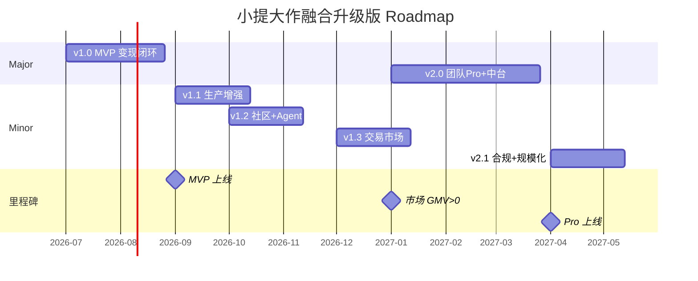

# 小提大作（融合升级版）· 产品 Roadmap

> **文档性质**：版本迭代规划 · 与 `prd-功能清单-按菜单切割.md` 配套  
> **基准日期**：2026-07-06（M0）  
> **状态**：✅ **已确认**（Maziluo · 2026-07-06）  
> **迭代节奏**：双周 Sprint × 3 = Minor **6 周**；Major 12–18 周  
> **团队编制**：前端 2 + 后端 2 + AI 1 + 设计 1（已确认）  
> **v1.0 目标上线**：**2026-09**（M0 + 8 周，已确认）

---

## 1. 迭代节奏总览

### 1.1 版本命名与发布节奏

| 类型 | 命名 | 周期 | 说明 |
|------|------|------|------|
| **Major** | v1.0 / v2.0 | 12–18 周 | 商业闭环或新付费线落地 |
| **Minor** | v1.1 / v1.2 | **6 周**（3×双周 Sprint） | 一个菜单域或一条生产链路完整交付 |
| **Patch** | v1.1.1 | **2 周**（1 Sprint） | Bugfix、运营配置、小交互优化 |
| **Hotfix** | — | 按需 | 资金/结算/鉴权类紧急修复，不走常规排期 |

### 1.2 里程碑时间轴（建议）

```
2026-Q3                    2026-Q4                    2027-Q1
│                          │                          │
├─ M0 Demo基线 (07月)       │                          │
├─ v1.0 MVP ──── 8周 ──────┤ 09月 变现闭环上线          │
├─ v1.1 生产增强 ─ 6周 ────┤ 10月 工具+画布生产稳定      │
├─ v1.2 社区+Agent ─ 6周 ──┤ 12月 引流与模板生态        │
├─ v1.3 交易市场 ── 6周 ───┤ 01月 作品/工作流售卖       │
├─ v2.0 团队Pro ─── 12周 ──┼─ 04月 指挥舱+数据看板      │
└─ v2.1 合规+出海 ─ 6周 ───┴─ 06月 发票+多语言+回传     │
```

### 1.3 迭代速度校准因子

| 因子 | 假设 | 对工期的影响 |
|------|------|-------------|
| 研发编制 | 前端 2 + 后端 2 + AI 1 + 设计 1 | Minor 6 周可交付 1 菜单域 |
| 基座复用 | 小提大作线上已有写作/画布/充值 | v1.0 偏集成，非从零 |
| 融合复杂度 | SOP 流水线 + WWDS + 双库文创 | 工具/文创各 +1 Sprint |
| 资金合规 | 提现/发票需财税评审 | v1.0 提现先行；发票推迟至 v2.1 |
| 第三方依赖 | 播放数据回传协议未定 | 自报先行（v1.0）；回传 v2.1 |

`[ASSUMPTION]`：上表为 **中等团队、中等风险** 估算；若研发 ×2，Minor 可压缩至 4 周。

---

## 2. 版本目标一句话

| 版本 | 目标 | 验证假设 |
|------|------|----------|
| **v1.0 MVP** | 跑通「创作 → 确权 → 分成 → 提现」最小变现闭环 | 创作者愿意在同一平台完成生产+收钱 |
| **v1.1** | 生产链路稳定：SOP 完片率、工具链可运营 | 新手能独立完成一部漫剧 |
| **v1.2** | 引流飞轮：大赏互动 + Agent 生态 | 社区互动带来注册与付费转化 |
| **v1.3** | 交易层：作品/工作流市场 GMV | 「过程即资产」可售卖 |
| **v2.0** | 团队 Pro：指挥舱 + 完整结算中台 | 工作室愿意付 Pro 费 |
| **v2.1** | 合规与规模化：发票、第三方回传、体验入口 | 平台可持续运营与出海 |

---

## 3. 分版本菜单交付矩阵

> 图例：**●** 本版新建/完整交付 · **◐** 本版增强/部分交付 · **○** 未纳入 · **—** 沿用线上已有

| 菜单 / 能力 | v1.0 MVP | v1.1 | v1.2 | v1.3 | v2.0 | v2.1 |
|-------------|----------|------|------|------|------|------|
| 16 全局框架 | ● 鉴权/login | ◐ 消息接入 | ◐ | ◐ | ◐ Pro 门槛 | ◐ 21 语言 |
| 05 创作 + 写作 | ● 写作闭环 | ◐ 剧本 Tab 流程确认 | ◐ | ◐ | ◐ | ◐ musicmv |
| 05 创作 + 画布/SOP | ◐ SOP 核心 7 步 | ● 断点续跑+计费+导出 | ◐ 自由画布增强 | ◐ | ● 自动入舱 | ◐ |
| 04 工具 | ◐ 评估+拆解 | ● 7 工具+审核流 | ◐ | ◐ | ◐ | ◐ |
| 02 Agent | ◐ 浏览+复制 | ◐ 创作阶段调用 | ● 付费+统计 | ◐ 市场联动 | ◐ | ◐ |
| 03 文创 | ● 双库浏览+申领 | ● 投稿+确权登记 | ◐ 爆榜 | ◐ 授权状态机 | ◐ | ◐ |
| 06 资产 | ◐ 三库 | ● 审核流+锁定规则 | ◐ | ◐ 可售素材 | ◐ | ◐ |
| 07 结算 | ● 版权+爆米花+提现 | ◐ 分佣入结算 | ◐ | ◐ 市场分成 | ● data 看板 | ● 发票 |
| 01 大赏 | ◐ 展示+搜索 | ◐ | ● 完整互动+复盘 | ◐ 市场引流 | ◐ | ◐ |
| 08–12 底部栏 | ● 教程+联系+个人基础 | ◐ userspace 扩展 | ● 任务积分 | ◐ | ◐ | ◐ |
| 13 交易市场 | ○ | ○ | ◐ | ● 三市场 | ◐ 订阅 | ◐ |
| 14 数据看板 | ○ | ○ | ◐ 播放自报 | ◐ | ● 完整中台 | ● 第三方回传 |
| 15 指挥舱 | ○ | ○ | ○ | ◐ | ● G0–G9 | ◐ 日报/QC |
| 体验 experience | ○ | ○ | ◐ | ◐ | ◐ | ● 游客试用 |

---

## 4. 分版本详细规划

### v1.0 MVP · 变现闭环（M0 + 8 周 → 目标 2026-09）

**North Star**：首个创作者完成「写作或 SOP 完片 → 文创确权 → 收到版权分成 → 提现到账」。

#### 范围（Must Have）

| 菜单 | 交付功能 | 对应 FR |
|------|----------|---------|
| 创作 | 项目 hub；写作编辑器；画布 SOP 七步（可完片） | FR-11~21（核心） |
| 文创 | 小说/剧本双库浏览筛选；WWDS 详情；申领/询价；确权登记 v1 | FR-24~27, FR-29 |
| 结算 | 概览三卡；版权结算；爆米花账户；**提现**（新建） | FR-33~36 |
| 全局 | 登录鉴权；7 项 nav 骨架；底部栏 | FR-46 |
| 教程/联系/个人 | 教程 6 篇；商务表单；个人设置基础 | FR-43~44, FR-41 |

#### 明确不做（Won't Have）

- 交易市场、指挥舱、大赏完整互动、发票、第三方播放回传
- userspace 扩展 Tab、爆榜 Tab、自由画布深度优化

#### 成功指标

| 指标 | 目标 |
|------|------|
| SOP 完片率 | ≥ 30% `[ASSUMPTION]` |
| 确权→首笔分成转化 | ≥ 5% 活跃创作者 |
| 提现成功率 | ≥ 95% |

#### Sprint 切分（4×2 周）

| Sprint | 交付 |
|--------|------|
| S1–S2 | 创作 hub + 写作 + SOP 流水线 API 打通；米花/爆米花计费 |
| S3 | 文创双库 + 确权登记 + 授权申请 v1 |
| S4 | 结算版权 Tab + 提现全流程 + 联调验收 |

---

### v1.1 · 生产增强（6 周 → 目标 2026-10）

**North Star**：SOP 完片率 ≥ 40%；工具链「评估→上架」可运营。

| 菜单 | 交付 |
|------|------|
| 画布 | 断点续跑生产化；自由画布 v1；成片/分镜导出；资产锁定规则 |
| 工具 | 7 工具全量 + 提交审核后台；视频结构→写作桥接 |
| 文创 | 编剧投稿/作家发布正式流程；小说详情页 |
| 资产 | 审核流打通；角色/场景与画布引用 |
| 结算 | 邀请分佣并入结算余额 |
| 消息 | 审核/授权/结算通知接入 |

---

### v1.2 · 社区 + Agent 生态（6 周 → 目标 2026-12）

**North Star**：大赏互动 DAU 占比 ≥ 15%；Agent 月调用量增长 50%。

| 菜单 | 交付 |
|------|------|
| 大赏 | 赞/藏/评/享/关；评论审核；反向复盘 v1 |
| Agent | 创作阶段一键调用；付费 Agent；使用统计 |
| 个人空间 | 历史存档/任务积分/互动分组 UI 化 |
| 数据 | 播放链接自报 + 审核 + 阶梯奖励 |
| 大赏/Agent | 互相引流入口 |

---

### v1.3 · 交易市场（6 周 → 目标 2027-01）

**North Star**：市场 GMV > 0；首个工作流订阅订单。

| 菜单 | 交付 |
|------|------|
| 交易市场 | 作品/工作流/知识库三 Tab 接入 nav |
| 文创 | 授权状态机完整；挂牌→审核→授权→分成 |
| 结算 | 市场订单分成入账 |
| 大赏 | 复盘跳转市场条目 |

---

### v2.0 · 团队 Pro + 结算中台（12 周 → 目标 2027-04）

**North Star**：≥ 3 家工作室开通 Pro；指挥舱与个人 SOP 数据零丢失。

| 菜单 | 交付 |
|------|------|
| 指挥舱 | G0–G9 Kanban；个人产物自动入舱；Pro 付费门槛 |
| 数据看板 | 完整结算中台（看板/明细/提现）接入 nav 或 settlement 扩展 |
| 创作 | 团队权限；QC 审核卡口 |
| 全局 | Pro/团队角色鉴权 |

---

### v2.1 · 合规与规模化（6 周 → 目标 2027-06）

**North Star**：发票流程合规上线；体验入口注册转化 ≥ 8%。

| 菜单 | 交付 |
|------|------|
| 结算/数据 | **发票**（决策④）；可开票口径确认 |
| 数据 | 第三方播放回传（协议确认后） |
| 公共层 | 体验 experience 游客试用 |
| 创作 | 影片 MV 模板入口 |
| 全局 | 21 语言完整覆盖；导出偏好 |

---

## 5. 版本与菜单功能条目映射

> 来源：`prd-功能清单-按菜单切割.md` 97 条功能

| 版本 | 新增/完整交付条目数 | 累计覆盖率 |
|------|---------------------|-----------|
| v1.0 | ~45 条（●+核心◐） | ~46% |
| v1.1 | +18 条 | ~65% |
| v1.2 | +12 条 | ~77% |
| v1.3 | +8 条 | ~85% |
| v2.0 | +10 条 | ~95% |
| v2.1 | +5 条 | ~100% |

---

## 6. 依赖与风险

| 风险 | 影响版本 | 缓解 |
|------|----------|------|
| 提现/财税合规评审慢 | v1.0 | 先上「申请→审核→到账」人工兜底 |
| SOP Agent 失败率高 | v1.0–v1.1 | 断点续跑 + 降级为自由画布 |
| WWDS 评估 API 不稳定 | v1.1 | 工具评估异步队列 + 重试 |
| 播放回传协议未定 | v2.1 | v1.2 仅自报；回传接口预留 |
| 团队 Pro 需求不足 | v2.0 | v1.3 后调研；可推迟 1 个 Minor |

---

## 7. 决策待办（Roadmap 启动前）

| # | 事项 | 阻塞版本 | 建议截止 |
|---|------|----------|----------|
| R1 | 确认 v1.0 研发编制与 Sprint 长度 | v1.0 | M0 + 1 周 |
| R2 | 提现手续费/税费/最低额 | v1.0 | S3 前 |
| R3 | 剧本 Tab 创建流程（写作 vs 画布） | v1.1 | v1.0 上线前 |
| R4 | settlement vs data 信息架构合并 | v2.0 | v1.3 前 |
| R5 | 第三方回传平台清单 | v2.1 | v1.2 前 |
| R6 | Pro 套餐定价与权益映射 | v2.0 | v1.3 前 |

---

## 8. Roadmap 可视化（Gantt 简图）



---

## 9. Excel 版 Roadmap 表（可复制）

| 版本 | 周期 | 目标上线 | 核心交付 | 菜单范围 | 成功指标 | 状态 |
|------|------|----------|----------|----------|----------|------|
| v1.0 MVP | 8 周 | 2026-09 | 变现闭环 | 创作/文创/结算/全局/教程 | 完片率≥30%；提现成功率≥95% | ✅ 已确认 |
| v1.1 | 6 周 | 2026-10 | 生产增强 | +工具/画布/资产/消息 | SOP 完片率≥40% | ✅ 已确认 |
| v1.2 | 6 周 | 2026-12 | 社区+Agent | +大赏/Agent/userspace | 大赏 DAU 占比≥15% | ✅ 已确认 |
| v1.3 | 6 周 | 2027-01 | 交易市场 | +market/授权状态机 | 市场 GMV>0 | ✅ 已确认 |
| v2.0 | 12 周 | 2027-04 | 团队 Pro | +指挥舱/data 中台 | ≥3 家 Pro 工作室 | ✅ 已确认 |
| v2.1 | 6 周 | 2027-06 | 合规规模化 | +发票/回传/体验 | 体验注册转化≥8% | ✅ 已确认 |

---

*Roadmap v1 · 2026-07-06 · 随研发容量评审迭代更新*
